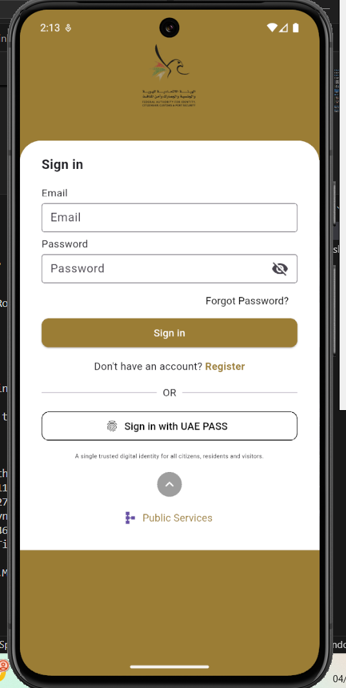
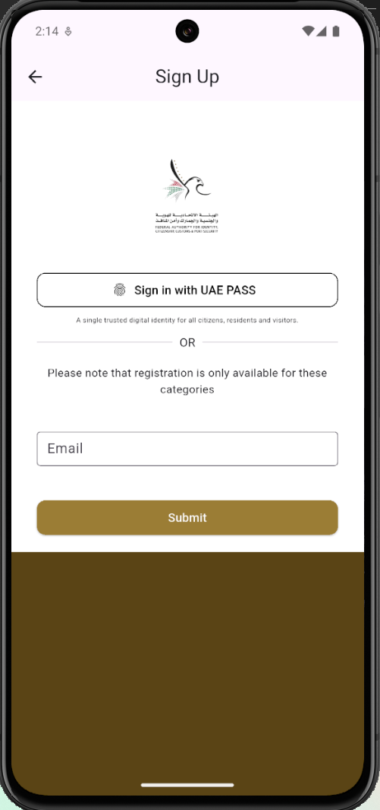
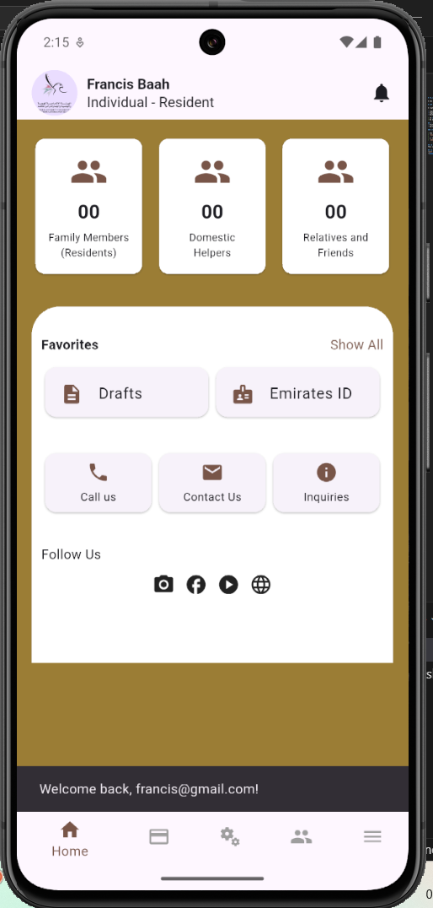

# fb_icp

A new Flutter project.

# ICP Lite Clone – Flutter UI

A lightweight Flutter UI clone of the UAE's ICP (Identity & Citizenship Portal) app. Includes:

- Login Page  
- Signup Page  
- Dashboard Screen  

> 🔐 **Fixed Demo Password**: `11223344`  
> No backend – screens are static or mock logic only.

## 🛠 Tech Stack
- Flutter
- Dart

## 📦 Download

You can find the release APK here:

➡️ [`release/ICP-Lite-Clone.apk`](release/ICP-Lite-Clone.apk)

> Install it on an Android device with:
> `adb install ICP-Lite-Clone.apk`

## 🚫 Disclaimer
This is a **demo UI clone** created for **educational and non-commercial purposes**. It does not replicate any actual services or data.

## 📷 Screenshots

